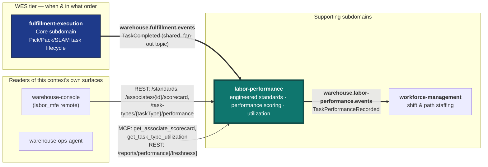

# Context Map

Labor Performance has exactly **one** input: it is a pure Kafka
**Customer** of `fulfillment-execution`'s already-published
`TaskCompleted` integration event. Everything else points the other way —
it publishes its own integration event and exposes its own REST, reports
and MCP surfaces that other contexts read. It has **no outbound REST or
MCP client** to any sibling context (ADR 0003, restated for facility-layout
by ADR 0015); there is no `internal/adapters/outbound/` package that
targets another service.



**Bold edges are live Kafka topics with a real publisher and a real
consumer on each end.** Thin edges are calls another context makes INTO
this service's own Open Host Service — this service never initiates them.
This service's third topic, `warehouse.labor-performance.analytics`, is
internal to its own analytical data product (consumed only by
`cmd/labor-projector`, ADR 0007) and is not an integration contract.

## → `fulfillment-execution` (live, inbound Kafka only)

**Strategically: Customer/Supplier, with this context as a Conformist
downstream.** `fulfillment-execution` is the Open Host Service; this context
subscribes to its Published Language (the `TaskCompleted` event shape) and
never gets write access to a `Task` or `Station` aggregate.

This service subscribes to **`warehouse.fulfillment.events`** — the SAME
shared, fan-out topic `wes-work-planning` already consumes from — under its
own consumer group id (`KAFKA_CONSUMER_GROUP`, `labor-performance` by
default). Only `event_type == "TaskCompleted"` is acted on; every other
event type on this shared topic is silently skipped, not an error,
mirroring `wes-work-planning`'s own consumer's skip-unrecognized-event-type
behavior.

The envelope (identical CloudEvents-like shape across every
warehouse-systems publisher):

```json
{
  "event_id": "uuid-v4",
  "event_type": "TaskCompleted",
  "occurred_at": "2026-08-29T22:00:00Z",
  "source": "fulfillment-execution",
  "data": {
    "task_id": "...",
    "station_id": "...",
    "work_unit_id": "...",
    "associate_id": "...",
    "duration_seconds": 52,
    "task_type": "PICK"
  }
}
```

`associate_id`, `duration_seconds` and `task_type` are all optional on the
wire: an older payload that predates an enrichment omits the field, and
this service's JSON unmarshaling degrades it to its Go zero value (`""` /
`0`) — exactly the "no checked-in occupant" / "unmeasurable duration" /
"unclassified" business facts this service's own aggregate invariants
already model, not an error.

### `task_type` on the wire (gap closed)

`task_type` was once a known wire-contract gap: every consumed event was
bucketed as `""` (unclassified). `fulfillment-execution` ADR-0023 added it
to the `TaskCompleted` payload, and this service's consumer now passes it
to `shared.ParseTaskTypeLenient`. A recognized `PICK`/`PACK`/`SLAM` passes
through; an unrecognized value (e.g. `REBIN`, which this context does not
model as an engineered-labor-standard task type) or an absent field still
resolves to `""` — recorded and counted, but never scored against a
`LaborStandard` and never listed under `GetTaskTypePerformance`.

The same event also drives idleness (ADR 0014): the gap between an
associate's previous completion and this task's claim instant
(`occurred_at − duration_seconds`) is recorded as an `IdlePeriod`, with no
additional upstream field required.

## → `workforce-management` (live, outbound Kafka)

**Strategically: this context is the upstream Supplier; `workforce-management`
is a Conformist Customer.** Since ADR 0013 this service publishes
`TaskPerformanceRecorded` onto its integration topic
**`warehouse.labor-performance.events`**, through the same transactional
outbox as the analytics topic (ADR 0010). `workforce-management`'s
`laborperformancecache` consumer (its ADR 0019, `LABOR_PERFORMANCE_MODE=kafka-cache`)
builds a local measured-rate read model from it for `ProposePathPlan`, and
reads the additive `idle_seconds_before` field (ADR 0014) as a staffing
signal (its ADR 0020).

`workforce-management` also keeps an older `LABOR_PERFORMANCE_MODE=http`
option that calls this service's `GET /task-types/{taskType}/performance`.
Either way the dependency points from `workforce-management` to this
context — this service has no Go import from, REST call to, or Kafka
subscription on `workforce-management`.

## ← `warehouse-console` (the `labor_mfe` remote)

`web/` is this context's Module Federation remote (`labor_mfe`), mounted
by the console shell at `/labor`. It calls only this service's own OLTP
REST API: `POST /standards`, `GET /associates/{associateId}/scorecard` and
`GET /task-types/{taskType}/performance`. CORS is configured through
`CORS_ALLOWED_ORIGINS` on both the OLTP and reports routers.

## ← `warehouse-ops-agent` (reads over MCP and the reports API)

`warehouse-ops-agent` reads this context through two of its own surfaces:

- the MCP server (`cmd/mcp`) — `get_associate_scorecard` and
  `get_task_type_utilization`, the latter feeding its flow-balance
  advisory (its ADR 0008);
- the reports API (`cmd/labor-reports`) — `GET /reports/performance` and
  `GET /reports/performance/freshness`, for the console's WES dashboard.

Both are unauthenticated reads (ADR 0012). This service knows nothing
about the agent.

## Why this is not one bounded context with `fulfillment-execution`

`fulfillment-execution` follows a strict "Task/Station only" design
discipline — adding a labor-standard concept there would be scope creep into
a domain neither Task nor Station has any business modeling. Splitting this
context out means a standard revision, an efficiency computation, or a
scorecard projection never needs to touch `fulfillment-execution`'s own
release cadence or test suite, and vice versa — `fulfillment-execution` can
evolve its Task/Station model without this context's scoring logic ever
being a blocker. See
[ADR 0002](/docs/adr/0002-new-bounded-context-not-extension-of-workforce-or-fulfillment)
and
[ADR 0003](/docs/adr/0003-kafka-choreography-consumer-of-fulfillment-execution)
for the full reasoning.
