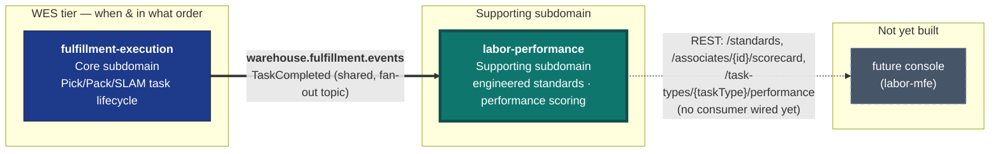

# Context Map

Labor Performance has exactly **one** relationship in the fleet: it is a pure
Kafka **Customer** of `fulfillment-execution`'s already-published
`TaskCompleted` integration event. It has **zero REST dependency** on any
other service, and it exposes its own REST Open Host Service for future
console consumption (`labor-mfe`, deferred — see the README's "Deferred
(v1)" section).



**Bold edges are live Kafka topics with a real publisher and a real consumer
on each end.** Dashed edges are relationships that exist strategically (a
REST surface this service exposes) and have no consumer wired to them yet.

## → `fulfillment-execution` (live, inbound Kafka only)

**Strategically: Customer/Supplier, with this context as a Conformist
downstream.** `fulfillment-execution` is the Open Host Service; this context
subscribes to its Published Language (the `TaskCompleted` event shape) and
never gets write access to a `Task` or `Station` aggregate.

This service subscribes to **`warehouse.fulfillment.events`** — the SAME
shared, fan-out topic `wes-work-planning` already consumes from — under its
own consumer group id (`labor-performance` by default). Only
`event_type == "TaskCompleted"` is acted on; every other event type on this
shared topic is silently skipped, not an error, mirroring
`wes-work-planning`'s own consumer's skip-unrecognized-event-type behavior.

The envelope (identical CloudEvents-like shape across every
warehouse-systems publisher):

```json
{
  "event_id": "uuid-v4",
  "event_type": "TaskCompleted",
  "occurred_at": "2026-08-29T22:00:00Z",
  "source": "fulfillment-execution",
  "data": {
    "task_id": "...",
    "station_id": "...",
    "work_unit_id": "...",
    "associate_id": "...",
    "duration_seconds": 52
  }
}
```

`associate_id` and `duration_seconds` are enrichments added by the sibling
`feature/labor-performance-hooks` change in `fulfillment-execution` this
session. Both are optional on the wire: an older payload that predates the
enrichment omits them, and this service's JSON unmarshaling degrades those
absent fields to their Go zero values (`""` / `0`) — exactly the "no
checked-in occupant" / "unmeasurable duration" business facts this
service's own aggregate invariants already model, not an error.

### Known wire-contract gap: no `task_type` field yet

As verified against `fulfillment-execution`'s actual `TaskCompletedData`
struct this session, the payload above does **not** carry a `task_type`
field. This service resolves `TaskType` as `""` (unclassified) for every
consumed event as a result — a `""`-typed row is still recorded and counted,
but never resolves a `LaborStandard` and never appears under
`GetTaskTypePerformance` (which requires PICK/PACK/SLAM). Adding `task_type`
to that payload is a natural, additive fast-follow on the
`fulfillment-execution` side. See the README's "Known gaps" section.

## ← `workforce-management` (none)

No relationship, deliberately. Labor allocation ("who is on shift, at what
rate") and labor performance scoring ("how well did this associate's
completed task measure against the standard") share no concepts. This
context has zero Go-import dependency and zero REST dependency on
`workforce-management`.

## → future console (`labor-mfe`, not yet built)

This context exposes its own REST Open Host Service (`POST /standards`,
`GET /standards/{taskType}`, `GET /associates/{associateId}/scorecard`,
`GET /task-types/{taskType}/performance`) symmetric with every other context
in the fleet — including CORS middleware wired proactively, matching the
fleet's convention that CORS ships alongside a service's first
console-facing REST surface. No consumer (no `labor-mfe` micro-frontend
remote) is wired to it yet; that screen is explicitly deferred to a later
PR (see the README's "Deferred (v1)" section).

## Why this is not one bounded context with `fulfillment-execution`

`fulfillment-execution` follows a strict "Task/Station only" design
discipline — adding a labor-standard concept there would be scope creep into
a domain neither Task nor Station has any business modeling. Splitting this
context out means a standard revision, an efficiency computation, or a
scorecard projection never needs to touch `fulfillment-execution`'s own
release cadence or test suite, and vice versa — `fulfillment-execution` can
evolve its Task/Station model without this context's scoring logic ever
being a blocker. See
[ADR 0002](/docs/adr/0002-new-bounded-context-not-extension-of-workforce-or-fulfillment)
and
[ADR 0003](/docs/adr/0003-kafka-choreography-consumer-of-fulfillment-execution)
for the full reasoning.
