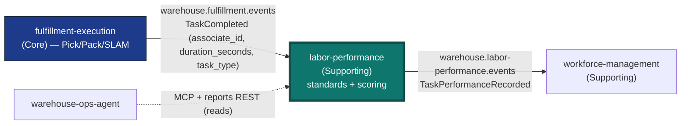

# Labor Performance

:::warning[Study project]
This documentation site is an educational Domain-Driven Design exercise. It
follows real industry-standard patterns and terminology, but it is **not a
production system** and is **not affiliated with, endorsed by, or
representative of any real-world
company**.
:::

**Labor Performance** is the fleet's engineered-labor-standards and
actual-vs-standard performance scoring context — the eighth bounded-context
Go service in the `warehouse-systems` fleet, after `order-management`,
`inventory-storage`, `wes-work-planning`, `workforce-management`,
`fulfillment-execution`, `facility-layout`, and `warehouse-ops-agent`.

## Why this context exists

Competitor research (Manhattan Active Labor Management, Blue Yonder
Workforce & Labor Management — both real, current products) converges on ONE
capability neither `workforce-management` nor `fulfillment-execution` has:
**engineered labor standards** (an expected time-per-task-type, e.g. "a PICK
should take 45s") and **actual-vs-standard performance scoring** ("this
associate's last PICK took 52s — 87% of standard"). Manhattan calls this
"Labor Monitoring"; Blue Yonder calls it "align labor to demand with
real-time operational signals." Both treat it as a distinct product
capability, not a sub-feature of shift/schedule planning.

This is new domain logic, not a rename of anything that exists.
`workforce-management` owns "who is on shift, on which PATH, at what rate"
and explicitly stops at the path boundary, never linking an associate to a
task. `fulfillment-execution` owns Task/Station lifecycle and has zero
concept of a "standard" to measure a completion against. Neither sibling
context can host this without compromising its own boundary discipline — see
[ADR 0002](/docs/adr/0002-new-bounded-context-not-extension-of-workforce-or-fulfillment)
for the full reasoning.

## What it owns

| Capability | What that means here |
| --- | --- |
| **LaborStandard** | An append-only history of "how long a TaskType should take," one active standard per TaskType at any time. |
| **TaskPerformance** | One scored, already-completed task — frozen at ingestion time against whatever standard was active when it finished. |
| **Scorecard** | A per-associate read model: task count, mean efficiency, per-TaskType breakdown. |
| **TaskTypePerformance** | A fleet-wide (all-associates) read model per TaskType — the "labor monitoring" view competitors surface independent of any one associate. |
| **IdlePeriod / Utilization** | The between-task idle gap per associate, derived from consecutive `TaskCompleted` events, and windowed utilization read models per TaskType and per associate ([ADR 0014](/docs/adr/0014-labor-utilization-idleness)). |
| **Labor Performance Report** | The analytical data product served by `cmd/labor-reports` ([ADR 0007](/docs/adr/0007-analytical-data-product)). |

## What it deliberately does not own

- **does not decide anything** — no automatic coaching, no automatic
  pay/bonus calculation (a real Manhattan feature, "Pay for Performance,"
  explicitly out of scope). This context only makes the actual-vs-standard
  picture legible, mirroring `workforce-management`'s own "flags a gap,
  does not decide" philosophy for `PathUnderstaffed`.
- **does not gate or block anything in `fulfillment-execution`** — a
  below-standard associate is still allowed to claim tasks. This is
  visibility, not enforcement.
- **does not talk to payroll, HR, or scheduling systems.**
- **does not call any sibling context synchronously** — no outbound REST
  or MCP client exists in this repo. Its only input is a Kafka
  subscription (choreography, not orchestration). See
  [ADR 0003](/docs/adr/0003-kafka-choreography-consumer-of-fulfillment-execution)
  and [ADR 0015](/docs/adr/0015-optional-travel-component-on-labor-standard).

## How it fits the fleet

This service subscribes to the SAME shared, fan-out topic
`wes-work-planning` already consumes from, and publishes its own
integration topic that `workforce-management` consumes. Other contexts
read it through its own REST, reports and MCP surfaces; it never calls
them. See the [Context Map](/docs/ecosystem/context-map) for the full
relationship analysis.

## Where to go next

- **[Domain vision](/docs/business-context/domain-vision)** — why this
  service exists in this shape.
- **[Subdomain classification](/docs/ddd/subdomain-classification)** —
  Supporting subdomain, the aggregates and invariants.
- **[Context map](/docs/ecosystem/context-map)** — every relationship
  this service has, and why none of them is an outbound call.
- **[API Reference](/docs/api-reference/rest/labor-performance-api)** — generated from the real,
  Spectral-linted `apis/openapi.yaml`.
- **[Reports API Reference](/docs/api-reference/rest-reports/labor-performance-reports-api)** —
  generated from `apis/openapi-reports.yaml`.
- **[MCP Governance Charter](/docs/mcp/governance-charter)** — the rules the
  `cmd/mcp` server follows.
- **[ADRs](/docs/adr)** — the consequential decisions, in Nygard format.
